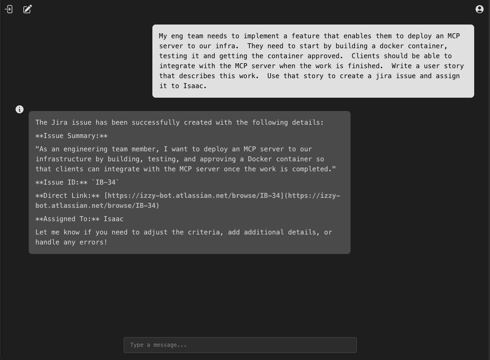
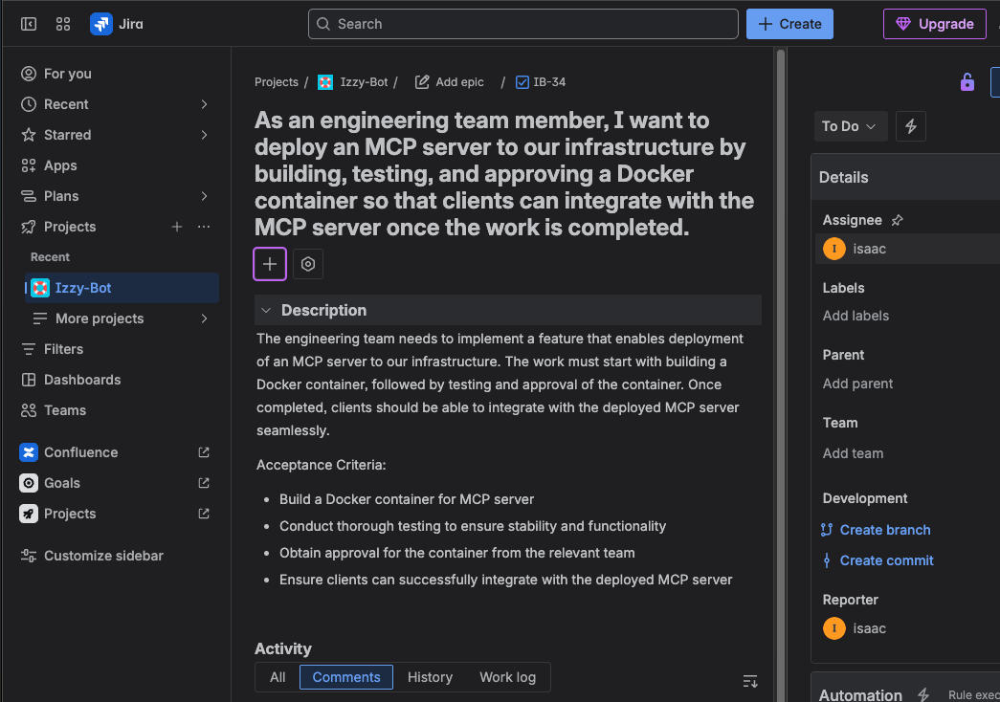

# Solesonic LLM API

A Spring Boot application that provides an API for interacting with Large Language Models (LLMs) using Ollama, with document processing capabilities, vector storage, and Retrieval Augmented Generation (RAG).

## Features

- **LLM Integration**: Uses Ollama for chat and embedding models
- **Intent-Based Prompts**: Automatically classifies user messages and selects appropriate prompts and tools
- **MCP Server Integration**: Connects to Model Context Protocol (MCP) servers with OAuth2 authentication
- **Document Processing**: Supports PDF and other document formats
- **Vector Storage**: Uses pgvector for efficient vector embeddings storage
- **RAG (Retrieval Augmented Generation)**: Enhances LLM responses with relevant context
- **User Management**: Supports user-specific chat history and preferences
- **Atlassian Integration**: Connects with Jira and Confluence for product management (see [PRODUCT_MANAGEMENT.md](PRODUCT_MANAGEMENT.md))
- **Security**: OAuth2 with JWT authentication

## Prerequisites

- Java 21
- Docker and Docker Compose
- Ollama
- PostgreSQL with pgvector extension (provided via Docker)

## Configuration

### Environment Variables

Create a `.env` file in the root directory with the following variables:

```
# Application Configuration
APPLICATION_NAME=solesonic-llm-api

# Database Configuration
SPRING_DATASOURCE_URI=jdbc:postgresql://localhost:5445/solesonic-llm-api
SPRING_DATASOURCE_USERNAME=solesonic-llm-api
SPRING_DATASOURCE_PASSWORD=docker_pw

# Training Configuration
TRAINING_ENABLED=false
CONFLUENCE_TRAINING_ENABLED=false

# Security Configuration
JWK_SET_URI=https://your-jwk-set-uri
ISSUER_URI=https://your-issuer-uri

# Jira API Configuration
JIRA_CLIENT_ID=your_jira_client_id
JIRA_CLIENT_SECRET=your_jira_client_secret

# MCP Server Configuration (optional)
MCP_ENABLED=false
MCP_CLIENT_ID=your_mcp_client_id
MCP_CLIENT_SECRET=your_mcp_client_secret

# CORS Configuration
CORS_ALLOWED_ORIGINS=http://localhost:3000

# Docker Database Password
DB_PASSWORD=docker_pw
```

**Important Note:** The database password **must** be defined in the `.env` file as shown above.

Replace placeholder values with your actual configuration.

### Application Properties

The application uses different property files for different environments:

- `application.properties`: Common properties
- `application-local.properties`: Local development properties
- `application-prod.properties`: Production properties
- `application-test.properties`: Test properties

## Getting Started

### 1. Start the Database

```bash
docker compose -f docker/docker-compose-db.yml up -d
```

This will start a PostgreSQL database with the pgvector extension on port 5445.

For more information about how the database schema is managed, see the [DATABASE.md](DATABASE.md) file.

### 2. Start Ollama

Ensure Ollama is installed and running on your machine. The application expects Ollama to be available at `http://localhost:11434`.

You can install Ollama from [https://ollama.ai/](https://ollama.ai/).

### 3. Build and Run the Application

#### Using Maven

```bash
./mvnw clean install
./mvnw spring-boot:run -Dspring-boot.run.profiles=local
```

#### Using an IDE

Import the project into your IDE (IntelliJ IDEA, Eclipse, etc.) and run the `SolesonicLlmAPI` class with the `local` profile.

### 4. Verify the Application

The application should be running at `http://localhost:8080`.

## API Endpoints

### Chat API

- `POST /izzybot/chats/users/{userId}` - Create a new chat for a user
- `PUT /izzybot/chats/{chatId}` - Update an existing chat (continue conversation)
- `GET /izzybot/chats/users/{userId}` - Get all chats for a user
- `GET /izzybot/chats/{chatId}` - Get a specific chat by ID

### Authentication

The application uses OAuth2 with JWT for authentication. In production, all requests require authentication with a valid JWT token.

For local development, authentication is more relaxed but still uses the JWT mechanism.

## Intent-Based Prompts

The Solesonic LLM API uses an intelligent intent classification system to automatically select the most appropriate prompts and tools based on user messages.

### How It Works

1. **Intent Classification**: Every user message is automatically classified into one of three intent types:
   - `GENERAL`: Regular chat conversations (no specialized tools needed)
   - `CREATING_JIRA_ISSUE`: Creating or managing Jira issues
   - `CREATING_CONFLUENCE_PAGE`: Creating or editing Confluence pages

2. **Automatic Tool Selection**: Based on the detected intent, the system automatically provides the appropriate tools:
   - **Jira Intent**: Includes Jira creation and assignee tools
   - **Confluence Intent**: Includes Confluence page creation tools
   - **General Intent**: No specialized tools attached

3. **Prompt Template Selection**: Each intent type uses a specialized prompt template optimized for that type of interaction.

### Configuration

The intent classification uses a separate LLM model configured via:

```properties
solesonic.llm.intent.model=qwen2.5:7b
```

The system uses a specialized prompt template (`intent_prompt.st`) to classify user messages with high accuracy.

### Benefits

- **Efficiency**: Users don't need to specify which tools they want to use
- **Context-Aware**: Responses are optimized for the specific type of task
- **Resource Optimization**: Only necessary tools are loaded for each conversation
- **Consistent Experience**: Similar requests always get the same type of specialized handling

## Example Usage

### Jira Integration Showcase

The following example demonstrates how the Solesonic LLM API can automatically create Jira issues based on natural language requests:

### **User Prompt:**



### **Resulting Jira Issue:**



In this example:
1. The user describes a need to deploy an MCP server using natural language
2. The system automatically detects the `CREATING_JIRA_ISSUE` intent
3. It creates a properly formatted Jira issue (IB-34) with:
   - User story format following best practices
   - Detailed description and acceptance criteria
   - Proper assignment to the specified user (Isaac)
   - Direct link to the created issue

This showcases the power of intent-based prompting and seamless Atlassian integration without requiring users to know specific Jira API calls or formatting.

## MCP Server Integration

The application supports integration with Model Context Protocol (MCP) servers, enabling connection to external tools and services with secure authentication.

### Authentication Setup

The MCP integration supports OAuth2 client credentials flow, designed to work with AWS Cognito but compatible with any OAuth2 identity provider.

#### Required Environment Variables

Add the following to your `.env` file:

```bash
# MCP Configuration
MCP_ENABLED=true
MCP_CLIENT_ID=your_mcp_client_id
MCP_CLIENT_SECRET=your_mcp_client_secret

# OAuth2 Provider (AWS Cognito or other)
ISSUER_URI=https://cognito-idp.region.amazonaws.com/user_pool_id
JWK_SET_URI=https://cognito-idp.region.amazonaws.com/user_pool_id/.well-known/jwks.json
```

#### AWS Cognito Setup

For AWS Cognito integration:

1. **Create App Client**: In your Cognito User Pool, create an app client with:
   - Client credentials grant type enabled
   - Appropriate OAuth scopes (e.g., `solesonic-mcp.read`)

2. **Configure Domain**: Set up a Cognito domain for token endpoint access

3. **Update Environment Variables**: Use your Cognito User Pool details:
   ```bash
   ISSUER_URI=https://cognito-idp.us-east-1.amazonaws.com/us-east-1_YourPoolId
   JWK_SET_URI=https://cognito-idp.us-east-1.amazonaws.com/us-east-1_YourPoolId/.well-known/jwks.json
   MCP_CLIENT_ID=your_cognito_app_client_id
   MCP_CLIENT_SECRET=your_cognito_app_client_secret
   ```

### How It Works

1. **Authentication Flow**: The system uses OAuth2 client credentials to obtain access tokens
2. **Token Management**: Access tokens are automatically refreshed and managed
3. **Request Authentication**: All MCP server requests include proper Authorization headers
4. **User Context**: When available, user JWT tokens are forwarded; otherwise, client credentials are used

### MCP Server Configuration

Configure your MCP server connection:

```properties
# MCP server URL (default: http://localhost:8081)
spring.ai.mcp.client.sse.connections.solesonic.url=http://your-mcp-server:port
```

The MCP integration automatically provides tools from connected MCP servers to the chat interface, extending the capabilities of the LLM with external services and data sources.

## Development

### Required Models

The application uses the following Ollama models:

- Chat model: `qwen2.5:7b`
- Embedding model: `twine/mxbai-embed-xsmall-v1:latest`

These models will be pulled automatically when missing.

### File Upload Limits

- Maximum file size: 20MB
- Maximum request size: 20MB

## License

See the [LICENSE](LICENSE) file for details.