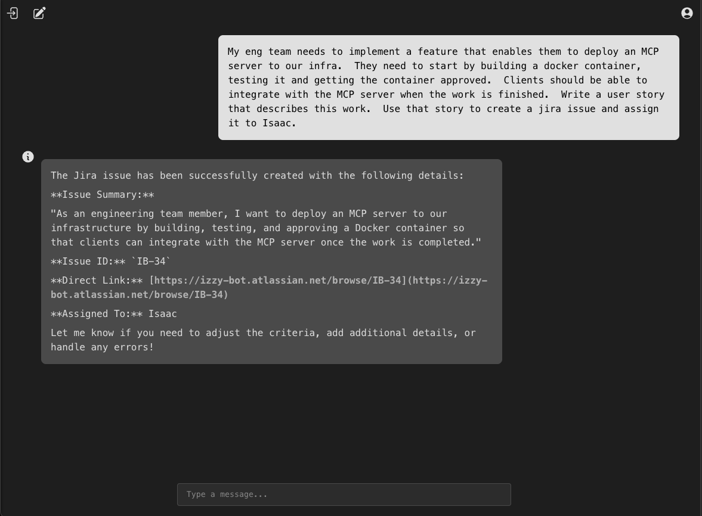

# Solesonic LLM API

> A Spring Boot API for intelligent LLM interactions with document processing, vector storage, and Retrieval Augmented Generation (RAG).

[](https://www.oracle.com/java/technologies/downloads/)
[](LICENSE)

## Features

- **LLM Integration** - Uses Ollama for chat and embedding models with intelligent response generation
- **Intent-Based Prompts** - Automatically classifies user messages and selects appropriate tools and prompts
- **MCP Server Integration** - Connects to Model Context Protocol (MCP) servers with secure OAuth2 authentication
- **Interactive Elicitation** - Real-time, structured user input during streaming chats via SSE with accept/decline/cancel actions
- **Document Processing** - Supports PDF and other document formats with intelligent content extraction
- **Vector Storage** - Uses pgvector for efficient vector embeddings storage and similarity search
- **RAG (Retrieval Augmented Generation)** - Enhances LLM responses with relevant contextual information
- **Slash Commands** - Type-ahead command system backed by the MCP tool catalog with Redis caching
- **Ollama Model Caching** - Redis-backed model metadata cache with configurable TTL and background refresh
- **User Management** - Supports user-specific chat history, preferences, and personalized model selection
- **Atlassian Integration** - Seamless connectivity with Jira and Confluence for product management workflows
- **OAuth2 Token Broker** - Secure 3-legged OAuth2 authentication with automatic refresh token rotation
- **Enterprise Security** - OAuth2 with JWT authentication, comprehensive authorization controls

## Quick Start

### Prerequisites

- **Java 25** or later
- **Docker and Docker Compose**
- **Ollama** (for LLM services)
- **Redis** (for streaming and caching)

### 1. Start Database

```bash
docker compose -f docker/docker-compose-db.yml up -d
```

### 2. Configure Environment

Create a `.env` file with minimal required variables:

```bash
# Database
DB_URL=jdbc:postgresql://localhost:5445/solesonic-llm-api
POSTGRES_USER=solesonic-llm-api
DB_PASSWORD=docker_pw

# Application
BOT_NAME=solesonic-llm-api
CORS_ALLOWED_ORIGINS=http://localhost:3000
```

> **Complete Configuration**: See [docs/configuration.md](docs/configuration.md) for all environment variables and advanced setup options.

### 3. Build and Run

```bash
# Build the application
./mvnw clean verify

# Run with local profile
./mvnw spring-boot:run -Dspring-boot.run.profiles=local
```

**IDE Users**: Import as Maven project and run `SolesonicLlmAPI` with `local` profile.

### 4. Verify Setup

The application runs at `http://localhost:8080`

```bash
# Health check
curl http://localhost:8080/actuator/health
```

## Intent-Based Prompts

The Solesonic LLM API features intelligent intent classification that automatically selects the most appropriate tools and prompts based on user messages, eliminating the need for users to specify which tools they want to use.

### How It Works

- **Automatic Classification**: Every message is classified as `GENERAL`, `CREATING_JIRA_ISSUE`, or `CREATING_CONFLUENCE_PAGE`
- **Smart Tool Selection**: Appropriate tools (Jira, Confluence) are automatically provided based on detected intent
- **Optimized Responses**: Context-aware responses tailored for specific task types
- **Consistent Experience**: Similar requests always receive the same specialized handling

This enables efficient, context-aware interactions where users can simply describe what they need in natural language.

## Example Usage

### Jira Integration Showcase

The following example demonstrates automatic Jira issue creation from natural language:

#### User Prompt:


#### Resulting Jira Issue:


**What happened:**
1. User described a deployment need using natural language
2. System automatically detected `CREATING_JIRA_ISSUE` intent
3. Created properly formatted Jira issue (IB-34) with user story format, detailed acceptance criteria, and proper assignment
4. Returned direct link to the created issue

This showcases the power of intent-based prompting and seamless Atlassian integration.

## MCP Server Integration

The API supports secure integration with Model Context Protocol (MCP) servers, enabling connection to external tools and services with enterprise-grade authentication.

**Key Features:**
- **Secure Token Broker**: 3-legged OAuth2 with refresh token rotation
- **Automatic Management**: Transparent token refresh and user context propagation
- **Security First**: Short-lived access tokens minimize exposure risk

The token broker acts as a secure intermediary, storing long-lived refresh tokens safely while providing short-lived access tokens to MCP servers.

> **Detailed Guide**: See [docs/mcp-integration.md](docs/mcp-integration.md) for complete integration instructions.

## Documentation

### Getting Started
- **[Getting Started Guide](docs/getting-started.md)** - Complete setup walkthrough with troubleshooting
- **[Configuration Reference](docs/configuration.md)** - All environment variables and configuration options

### Development and API
- **[API Documentation](docs/api.md)** - Complete API reference with examples
- **[Contributing Guide](docs/contributing.md)** - Development setup and contribution guidelines

### Architecture and Integration
- **[MCP Integration](docs/mcp-integration.md)** - Model Context Protocol server integration
- **[Elicitation](docs/elicitation.md)** - Interactive, structured input flow over streaming chat
- **[Product Management](docs/product-management.md)** - Jira/Confluence integration and RAG workflows
- **[Database Schema](docs/database.md)** - PostgreSQL with pgvector setup and migrations

### Deployment and Security
- **[Deployment Guide](docs/deployment.md)** - Production deployment strategies
- **[Security Guide](docs/security.md)** - OAuth2, JWT, and security architecture

### Operations
- **[Troubleshooting Guide](docs/troubleshooting.md)** - Common issues and solutions

## Links

**Project Resources:**
- **[LICENSE](LICENSE)** - Apache 2.0 License

---

**Ready to get started?** Follow the [Getting Started Guide](docs/getting-started.md) for detailed setup instructions.
