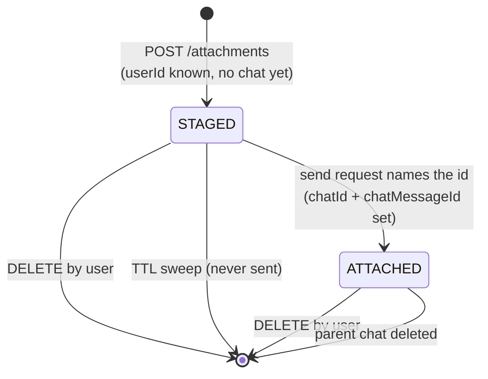
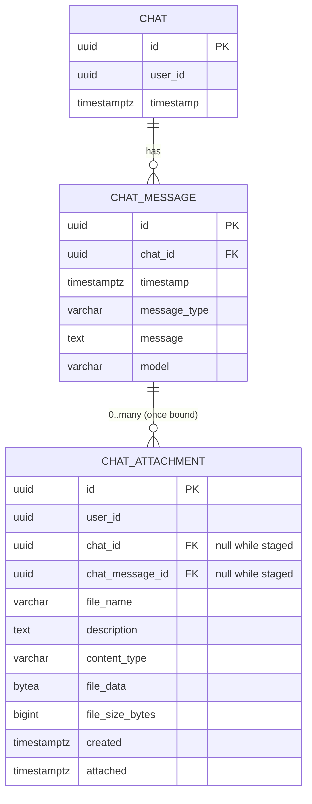
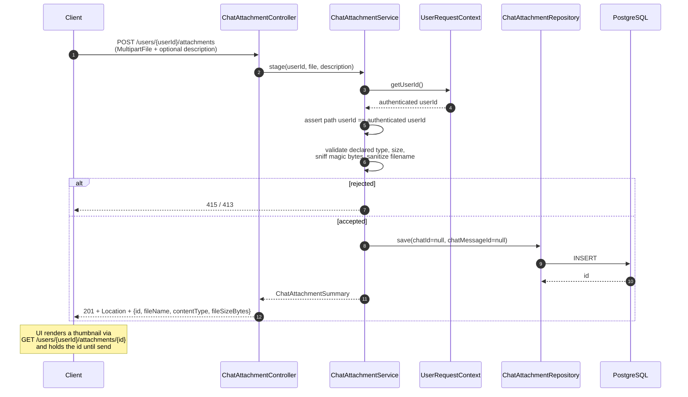
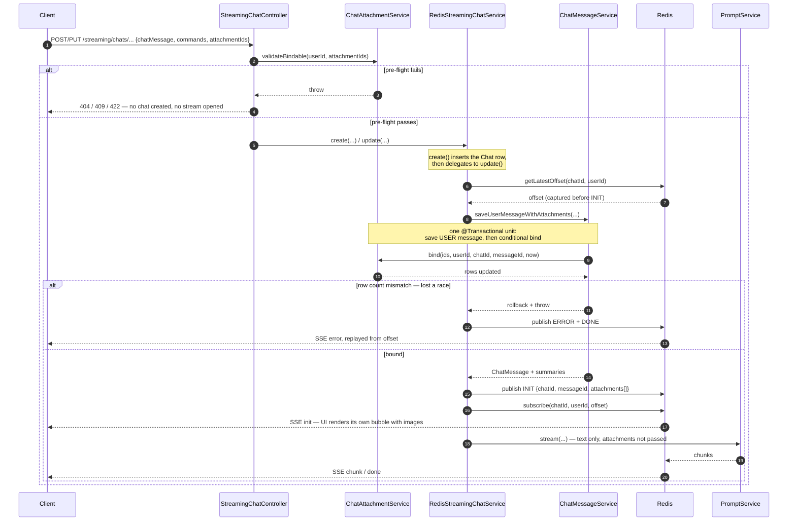
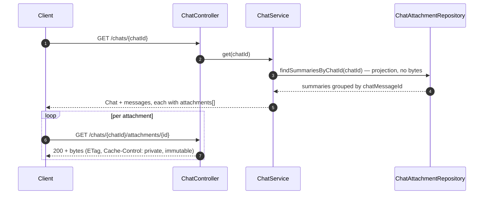

# Chat Attachment Upload — Design

Image documents uploaded by a user and attached to a single chat message. A chat
message may have **0 to many** attachments; each attachment belongs to at most one
chat message.

> **Scope:** image files only (`image/png`, `image/jpeg`, `image/gif`, `image/webp`).
> Non-image content types are rejected at the API boundary.
>
> **Explicitly out of scope:** feeding attachment bytes to the LLM. This design
> covers upload, lifecycle, storage, retrieval and deletion only. Attachments are
> stored and rendered by the UI; the model does not see them. §10 notes the seams
> that keep that door open.

---

## 1. Lifecycle Decision

An attachment is uploaded **before** the message it belongs to exists. There is no
endpoint that creates a `ChatMessage` — user messages are written during a stream
(see §6) — so at the moment the user picks a file there is nothing to attach to.

Three options were considered:

| Option | Verdict |
|--------|---------|
| **A.** Upload against `messageId` | **Impossible.** No message id exists at upload time, and none is ever returned to the client (§6). |
| **B.** Stage parentless, auto-bind to the next message in the chat | **Rejected.** Implicit binding is ambiguous — see below. |
| **C.** Stage parentless, bind explicitly by id at send time | **Chosen.** |

**Why not B.** "Attach whatever is pending to the next message" fails on:

- *Concurrent tabs* — an upload staged in one tab is claimed by an unrelated
  message sent from another.
- *Remove-before-send* — the client must guarantee its `DELETE` lands before the
  send, or the removed image is attached anyway.
- *Stream resume* — `Last-Event-ID` reconnects re-enter `update(...)`; a retried
  send can re-bind or double-bind.
- There is no way to express "send this message *without* the file I uploaded."

**Chosen model (C).** Upload returns an `attachmentId`. The client echoes the ids
it means in the send request. The server binds only those ids, and only if each one
is staged, owned by the caller, and not already bound. Same round-trip count as B,
no ambiguity.

**Staging is user-scoped, not chat-scoped.** The `Chat` row is not created until
`RedisStreamingChatService.create` runs, so a user attaching an image to the
*opening* message of a new chat has no `chatId` to stage against. Staged rows
therefore carry `userId` and a null `chatId`; both `chatId` and `chatMessageId` are
filled at bind time.



State is **derived, not stored**: `chat_message_id IS NULL` means staged. A separate
status column would be redundant and can drift out of sync with the FK.

---

## 2. Object Model

Follows existing persistence conventions: JPA entity, UUID primary key, and **loose
UUID references** to `Chat`/`ChatMessage` (matching how `ChatMessage` references
`Chat` via a plain `chatId` rather than a JPA association).

Named `ChatAttachment` rather than `MessageAttachment` because for part of its life
it has no message.



### `ChatAttachment` entity

| Field           | Type            | Notes                                                                 |
|-----------------|-----------------|-----------------------------------------------------------------------|
| `id`            | `UUID`          | `@GeneratedValue(strategy = GenerationType.UUID)`                     |
| `userId`        | `UUID`          | Owner. Set at upload from `UserRequestContext`; never client-supplied |
| `chatId`        | `UUID`          | Null while staged; set at bind                                        |
| `chatMessageId` | `UUID`          | Null while staged; set at bind. Non-null ⇒ immutable                  |
| `fileName`      | `String`        | Sanitized original filename                                           |
| `description`   | `String`        | Nullable free text describing what the image contains. `TEXT` column  |
| `contentType`   | `String`        | **Detected** MIME type (§7), not the client-declared one              |
| `fileData`      | `byte[]`        | `@JdbcTypeCode(SqlTypes.VARBINARY)`. Eagerly mapped, never read through the entity — see §3 |
| `fileSizeBytes` | `long`          | Enforced against a configurable max                                   |
| `created`       | `ZonedDateTime` | Upload time. Drives the TTL sweep                                     |
| `attached`      | `ZonedDateTime` | Bind time; null while staged                                          |

No `updated` column — attachments are immutable once written. The only permitted
mutations are the one-way staged → attached transition and `description`.

### `description`

Free text describing what the image contains — supplied by the client at upload time
as an optional multipart parameter. It travels on the summary so the UI can render it
(as caption or alt text) from history without downloading bytes.

Nullable by design: most uploads won't have one, and an empty description must never
block an upload. It is also the one field a later process may write after the fact —
see §10.

### Metadata projection

Every read path except download must avoid loading `fileData`:

```java
public interface ChatAttachmentSummary {
    UUID getId();
    UUID getChatMessageId();
    String getFileName();
    String getDescription();
    String getContentType();
    long getFileSizeBytes();
    ZonedDateTime getCreated();
}
```

The entity itself is only ever loaded on the write path (upload). Reads go through
either this projection or the dedicated byte query in §3 — never
`findById(...).getFileData()`.

---

## 3. Storage

**`bytea`, not `oid`.** `IngestedDocument` uses `@Lob byte[]`, which Hibernate maps
to a Postgres **large object** — `V1_3__initialize_training_document.sql` declares
`file_data oid`. That is the wrong choice here for two reasons:

1. Attachments have a `DELETE` endpoint. Deleting the row leaves the large object
   orphaned in `pg_largeobject` forever unless `lo_unlink` is called explicitly or
   `vacuumlo` is run out of band. `IngestedDocument` gets away with it because
   deletion is rare; a chat UI's ✕ button is not rare.
2. Large objects require an open transaction to stream, which complicates serving
   bytes from a controller.

So: `@JdbcTypeCode(SqlTypes.VARBINARY)` on the field and `file_data bytea not null`
in the migration. Row deletion then reclaims the bytes.

**Bytes are read by a dedicated query, not by lazy loading.** `@Basic(fetch = LAZY)`
on a `byte[]` is not reliable — Hibernate only honours it with bytecode enhancement
enabled, and a lazy attribute accessed outside an open session throws
`LazyInitializationException`. Since the download path runs from a controller, that
is a trap. Instead the attribute stays eagerly mapped and **nothing reads it through
the entity**:

```java
@Query("select attachment.fileData from ChatAttachment attachment where attachment.id = :attachmentId")
Optional<byte[]> findFileDataById(UUID attachmentId);
```

Every other read uses `ChatAttachmentSummary`. Two rules, mechanically checkable in
review: no `findById` outside `ChatAttachmentService`, and no getter call on
`fileData` outside the download method.

**Size ceiling.** `solesonic.llm.attachment.max-size-bytes` must sit *below*
`spring.servlet.multipart.max-file-size` (currently `20MB` in
`application-prod.properties:56`, and likewise in `-local`/`-prod-nginx`), so the
service-level check runs before the container's. See §7 for why this matters.

### Migration — `V3_4__initialize_chat_attachment.sql`

Latest existing migration is `V3_3`.

```sql
create table public.chat_attachment
(
    id              uuid not null primary key,
    user_id         uuid not null,
    chat_id         uuid,
    chat_message_id uuid,
    file_name       varchar(255) not null,
    description     text,
    content_type    varchar(255) not null,
    file_data       bytea        not null,
    file_size_bytes bigint       not null,
    created         timestamp(6) with time zone not null,
    attached        timestamp(6) with time zone,
    constraint chat_attachment_bound_together
        check ((chat_id is null and chat_message_id is null and attached is null)
            or (chat_id is not null and chat_message_id is not null and attached is not null))
);

create index chat_attachment_chat_message_id_idx on public.chat_attachment (chat_message_id);
create index chat_attachment_staged_idx on public.chat_attachment (user_id, created)
    where chat_message_id is null;

alter table public.chat_attachment owner to "${DB_OWNER}";
```

The check constraint makes a half-bound row unrepresentable. The partial index
serves both the staged-listing query and the TTL sweep.

No FK constraints to `chat`/`chat_message`, consistent with `chat_message.chat_id`
being unconstrained today. Cascade behaviour is handled in the service layer (§6).

---

## 4. API Endpoints

All routes are user-scoped or chat-scoped in the path so ownership is structural
rather than something a handler has to remember to check.

| Method   | Path                                                    | Purpose                                   |
|----------|---------------------------------------------------------|-------------------------------------------|
| `POST`   | `/users/{userId}/attachments`                           | Upload one image (repeat for many). Staged |
| `GET`    | `/users/{userId}/attachments`                           | List the caller's staged attachments      |
| `GET`    | `/users/{userId}/attachments/{attachmentId}`            | Download bytes — staged, pre-send preview |
| `DELETE` | `/users/{userId}/attachments/{attachmentId}`            | Remove a staged attachment                |
| `GET`    | `/chats/{chatId}/attachments`                           | List metadata for the whole chat          |
| `GET`    | `/chats/{chatId}/attachments/{attachmentId}`            | Download bytes of a bound attachment      |
| `DELETE` | `/chats/{chatId}/attachments/{attachmentId}`            | Remove a bound attachment                 |

Upload mirrors the `POST /documents/data/upload` convention: `MultipartFile` in,
`201 Created` + `Location` out — but unlike that endpoint it returns a body, because
the client needs the id immediately.

There is deliberately **no** `POST /chats/{chatId}/messages/{messageId}/attachments`.
Binding happens through the send request (§5), never as a standalone call, which is
what keeps "bound" a one-way transition.

`GET /chats/{chatId}/attachments` returns the whole chat's metadata in one call
rather than per-message, so rendering history is one request regardless of message
count. Alternatively `ChatService.get`/`getByUserId` can inline attachment summaries
onto each returned `ChatMessage` — preferable if the UI already loads chats that way.

### Responses

Attachment endpoints:

| Condition                                   | Status                       |
|---------------------------------------------|------------------------------|
| Upload accepted                             | `201` + `Location` + body    |
| Content type outside the allowlist          | `415 Unsupported Media Type` |
| Declared type contradicts magic bytes       | `415`                        |
| Over `max-size-bytes`                       | `413 Payload Too Large`      |
| Over `max-staged-per-user`                  | `422 Unprocessable Entity`   |
| Unknown id, or owned by another user        | `404` (never `403` — §7)     |

The streaming endpoints gain pre-flight failures (§5.2), returned **before** any SSE
stream opens:

| Condition                                   | Status                       |
|---------------------------------------------|------------------------------|
| `attachmentIds` names an unknown/unowned id | `404`                        |
| `attachmentIds` names an already-bound id   | `409 Conflict`               |
| More than `max-per-message` ids             | `422 Unprocessable Entity`   |

---

## 5. Flows

### 5.1 Upload (staging)



### 5.2 Send and bind

`ChatRequest` gains a third component:

```java
public record ChatRequest(String chatMessage, Set<String> commands, Set<UUID> attachmentIds) {
}
```

Jackson tolerates clients that omit the field; it arrives as `null` and is treated as
empty. Existing callers keep working unchanged.

Binding is **two-phase**, and the split is load-bearing:

**Phase 1 — pre-flight, synchronous, in the controller.** Before any `Chat` row is
inserted or any stream opened, `ChatAttachmentService.validateBindable(userId, ids)`
checks existence, ownership, staged-ness and count, throwing on failure. This exists
because `RedisStreamingChatService.create` inserts the `Chat` row *before* delegating
to `update()` (`:77–85`). Validating afterwards would leave an empty orphan chat
behind every rejected send. It also lets the client receive a normal HTTP `4xx`
instead of having to parse an error out of an event stream — an SSE endpoint can
still return a status code as long as the exception is thrown before the `Flux` is
returned.

**Phase 2 — authoritative claim, transactional, inside the stream.** Pre-flight is
advisory: an attachment can be deleted or claimed by a concurrent request in the gap.
The real bind is a single conditional update that both checks and claims:

```java
@Modifying
@Query("""
        update ChatAttachment attachment
           set attachment.chatId = :chatId,
               attachment.chatMessageId = :chatMessageId,
               attachment.attached = :attached
         where attachment.id in :attachmentIds
           and attachment.userId = :userId
           and attachment.chatMessageId is null
       """)
int bind(Set<UUID> attachmentIds, UUID userId, UUID chatId, UUID chatMessageId, ZonedDateTime attached);
```

If the returned row count differs from `attachmentIds.size()`, the transaction rolls
back and the turn is rejected. No locking, no read-then-write race.

**Ordering.** `INIT` is published inside `update()`'s chain (`:99–101`), *before*
`publishToRedisStream` is called (`:103`). The message save and bind must therefore
happen in that chain, ahead of the `INIT` publish — not inside
`publishToRedisStream` as an earlier draft of this document showed.



Events published between the offset capture and `subscribe(...)` are still delivered,
because the subscription resumes from the offset taken *before* `INIT`
(`RedisStreamService:73–86`). A phase-2 failure therefore reaches the client even
though it happens before the subscriber attaches.

### `INIT` payload

`INIT` currently carries an empty `ChunkPayload` (`RedisStreamService:44–48`). It
gains a real body, which is a **frontend contract change** and must land in
`docs/api.md`:

```java
public record InitPayload(UUID chatId, UUID messageId, List<ChatAttachmentSummary> attachments) {
}
```

Existing clients ignoring the `init` body keep working; clients that want to render
the outgoing bubble server-authoritatively can now do so, since `messageId` is real
rather than `null`.

### 5.3 History load



Bytes are immutable once written, so serving a strong `ETag` and
`Cache-Control: private, max-age=..., immutable` means re-opening a chat costs
`304`s rather than re-transferring every image.

### 5.4 Deletion and sweep

- **User deletes a staged attachment** → row deleted, bytes reclaimed.
- **User deletes a bound attachment** → row deleted. The parent `ChatMessage` is
  untouched; history keeps the text.
- **Staged and never sent** → swept by `ChatAttachmentSweepTask` (§6).
- **Chat deleted** → nothing to do. **There is no chat deletion in this codebase** —
  `ChatController` exposes only two `GET`s and no service deletes a `Chat` or
  `ChatMessage`. `ChatAttachmentService.deleteByChatId(UUID)` is provided anyway so
  that whoever adds chat deletion has an obvious hook, but wiring it is out of scope
  and there is no orphan risk until that endpoint exists.

---

## 6. Required Changes to the Existing Chat Flow

Binding needs a `ChatMessage` row whose id is known before the stream starts. Today
neither is true.

**How user messages are persisted now.** `MessageChatMemoryAdvisor`
(`config/olllama/ChatConfig.java:39`) calls `DatabaseChatMemory.add(...)`
(`config/olllama/DatabaseChatMemory.java:41`) mid-stream, which builds and saves the
`ChatMessage`. The id is never surfaced: the `done` event wraps a transient,
never-saved `ChatMessage` constructed at `RedisStreamingChatService.java:137`, whose
`id` is `null`.

Worse, on the **A2A path** (`PromptService.java:108` and `:151`) `ChatClient` is
never invoked at all, so the memory advisor never runs and **no user message is
persisted**. Any binding scheme built on the current behaviour would silently lose
attachments on agent turns.

**Change.** Persist the user message explicitly, at the one point every route passes
through:

1. `ChatMessageService.save(ChatMessage)` returns the saved `ChatMessage` instead of
   `void`. Its `UserPreferences` lookup joins through `Chat`
   (`UserPreferencesRepository:16–21`), and `create()` inserts the `Chat` row before
   delegating to `update()` (`RedisStreamingChatService:77–85`), so an early save
   resolves fine.
2. A new `@Transactional` method — `saveUserMessageWithAttachments(chatId, userId,
   chatRequest)` — saves the `USER` message and performs the conditional bind (§5.2)
   as one unit, returning the message plus its attachment summaries. This must be
   `@Transactional`: `publishToRedisStream` is not, and runs on
   `Schedulers.boundedElastic()`, so without an explicit boundary a failed bind would
   leave a persisted user message with no attachments.
3. `RedisStreamingChatService.update` calls it inside the reactive chain **before**
   the `INIT` publish (`:99–101`), and enriches `INIT` with `messageId` + summaries.
4. `DatabaseChatMemory.add` skips `MessageType.USER` — already persisted by the
   caller — and continues saving `ASSISTANT`.
5. `DatabaseChatMemory.get` drops a **trailing** `USER` message. See below.

`RedisStreamingChatService` is the sole entry point for every chat stream, and
`taskChatClient` is only reached from inside one (`ToolCallService` via
`SlashCommandService.taskClient`), so steps 4–5 have no other callers to break.

This is worth doing on its own merits: user messages start being persisted uniformly
across all five routes, and `init`/`done` carry real ids instead of `null`.

### Why `get` must drop a trailing `USER` message

This is the non-obvious part of the change and the easiest thing to get wrong.

`MessageChatMemoryAdvisor` does two things per turn: it *reads* history via
`DatabaseChatMemory.get(conversationId)` and prepends it to the prompt, and it
*writes* the turn back afterwards via `add(...)`. Today the current user message is
not yet persisted when `get` runs, so it appears in the prompt exactly once — as the
live user message.

Once step 2 persists it up front, `get` returns it too. The model would then see the
current turn twice, every turn: once as replayed history, once as the actual user
message. Nothing crashes; the conversation just quietly degrades.

So `ChatMessageService.findByChatId` — the backing call for
`DatabaseChatMemory.get` — must drop the last message when its type is `USER`. That
is deterministic: messages are ordered by timestamp ascending
(`ChatMessageRepository:13–17`), and after step 2 the newest `USER` row is always the
in-flight turn.

The one imperfect case: a previous turn that saved its user message and then failed
before any assistant reply leaves a trailing `USER` row that is genuinely historical,
and it will be dropped from the next turn's context. That is a lossy edge, not a
correctness bug — and it is preferable to duplicating every turn. Worth an explicit
test.

**New scheduled task.** `task/ChatAttachmentSweepTask`, following the existing
`DocumentIngestionSchedulingTask` pattern: delete rows where
`chat_message_id is null and created < now() - staged-ttl`. Served by the partial
index from §3.

---

## 7. Validation & Security

- **Ownership.** `userId` is taken from `UserRequestContext` (`scope/`), never from
  the path or body — the path value is only asserted to match. Note that the existing
  streaming endpoints accept `userId` as a path variable without verifying it against
  the token; attachment endpoints must not repeat that, since an IDOR here leaks
  users' screenshots rather than just chat text.
- **404, not 403,** for attachments the caller doesn't own. A `403` confirms the id
  exists.
- **Magic-byte sniffing is required, not optional hardening.** Bytes are echoed back
  to a browser. Sniff the actual type, persist the *detected* value, and reject when
  it contradicts the declared one. Serve with `X-Content-Type-Options: nosniff` and
  `Content-Disposition: inline; filename="<sanitized>"` — never reflect the raw
  client filename into a header.
- **Filename sanitization** at upload: strip path separators, control characters and
  newlines before persisting.
- **`413` needs a handler.** Exceeding `spring.servlet.multipart.max-file-size`
  throws `MaxUploadSizeExceededException` inside the container, before any service
  code runs. `GeneralExceptionHandler` currently maps every `Exception` to a chat-shaped
  `SolesonicChatResponse` body (`exception/handler/GeneralExceptionHandler.java:58`),
  so without an explicit `@ExceptionHandler(MaxUploadSizeExceededException.class)`
  the documented `413` will actually surface as that generic response.
- **Two count ceilings.** `max-per-message` is enforced at bind, but on its own it
  bounds nothing: staging is unbound by any message, so a client could upload
  indefinitely without ever sending. `max-staged-per-user` is therefore enforced at
  **upload** against the caller's current staged count, and is what actually caps
  storage. The TTL sweep bounds it over time; this bounds it instantaneously.
- **Bytes are never logged**, and `fileData` is excluded from any JSON serialization
  of the entity — the API returns summaries, not entities.

---

## 8. Configuration

New `${VAR}` placeholders must be added to `docs/configuration.md`, per
`docs/contributing.md`.

| Property                                            | Default              | Notes                                        |
|-----------------------------------------------------|----------------------|----------------------------------------------|
| `solesonic.llm.attachment.max-size-bytes`           | `10485760` (10 MB)   | Must be < `spring.servlet.multipart.max-file-size` (20 MB) |
| `solesonic.llm.attachment.max-per-message`          | `5`                  | Enforced at bind                             |
| `solesonic.llm.attachment.max-staged-per-user`      | `20`                 | Enforced at upload — the real storage cap    |
| `solesonic.llm.attachment.allowed-content-types`    | the four image types | Comma-separated                              |
| `solesonic.llm.attachment.staged-ttl`               | `PT24H`              | Age after which unbound rows are swept       |
| `solesonic.llm.attachment.sweep-cron`               | `0 0 * * * *`        | Hourly                                       |

---

## 9. Testing

`application-test.properties` expects `SPRING_DATASOURCE_URL` /
`SPRING_DATASOURCE_PASSWORD` against a real Postgres — there is no embedded or
Testcontainers database wired up despite the dependency being present. Anything
touching the repository needs `docker/docker-compose-db.yml` running.

**Needs a database:**

- Round trip through `bytea`: upload → `findFileDataById` returns identical bytes.
- The conditional bind (§5.2) updates exactly the named rows, and returns a short
  count when one id is already bound — the rollback trigger.
- The `chat_attachment_bound_together` check constraint rejects a half-bound row.
- Sweep deletes only rows past `staged-ttl` with a null `chat_message_id`.
- `max-staged-per-user` is enforced against real staged counts.

**Pure unit tests:**

- Content-type allowlist and magic-byte mismatch rejection, per format.
- Filename sanitization: path separators, control characters, newlines.
- `findByChatId` drops a trailing `USER` message, keeps a trailing `ASSISTANT`, and
  returns an empty list unchanged (§6 — this is the regression that would otherwise
  duplicate every turn silently).

**Integration, highest value:** a send carrying `attachmentIds` produces one `USER`
`ChatMessage`, exactly one bound attachment row per id, and an `INIT` event whose
payload carries the real `messageId`. That single test covers the whole §6 change.

---

## 10. Seams Left for Later

Not built now, but the model does not preclude them:

- **Sending images to the model.** `fileData` + `contentType` is exactly what
  `org.springframework.ai.content.Media` needs. The insertion points are
  `PromptService.streamBasicPrompt` and, per route, `PromptSlashCommand`,
  `ToolCallService.invoke`, and the A2A `TextPart`-only paths. Replaying images
  through `ChatMessageService.findByChatId` raises real context-cost questions that
  belong in that design, not this one.
- **Generated descriptions.** `description` is client-supplied today, but it is the
  obvious target for a vision model to populate after upload. Because it already
  travels on the summary, nothing downstream changes when the source of the text
  changes — and a stored description is the cheap way to replay image context into
  older turns without re-sending bytes.
- **A downscaled variant** alongside the original, for thumbnails now and prompt
  payloads later.
- **Non-image attachments.** Widening the allowlist touches only validation; the
  storage and lifecycle model is content-type agnostic.
- **Object storage.** Swapping `bytea` for an S3 key is a change to
  `ChatAttachmentService` plus a column, because nothing outside that service reads
  `fileData`.

---

## 11. New / Touched Components

| Layer      | Component                                       | Status  |
|------------|--------------------------------------------------|---------|
| Model      | `model/chat/attachment/ChatAttachment`          | new     |
| Model      | `ChatAttachmentSummary` (projection)            | new     |
| Model      | `InitPayload` (SSE `init` wire model)           | new     |
| Model      | `model/chat/ChatRequest` — add `attachmentIds`  | changed |
| Repository | `repository/chat/ChatAttachmentRepository`      | new     |
| Service    | `service/chat/attachment/ChatAttachmentService` | new     |
| Service    | `ChatMessageService.save` returns `ChatMessage` | changed |
| Service    | `ChatMessageService.saveUserMessageWithAttachments` (`@Transactional`) | new |
| Service    | `ChatMessageService.findByChatId` — drop trailing `USER` | changed |
| Service    | `RedisStreamingChatService.update` — save + bind before `INIT`, enrich `INIT` | changed |
| Service    | `ChatService` — include attachment summaries    | changed |
| Config     | `DatabaseChatMemory.add` — skip `USER`          | changed |
| API        | `api/chat/ChatAttachmentController`             | new     |
| API        | `StreamingChatController` — pre-flight validation | changed |
| Task       | `task/ChatAttachmentSweepTask`                  | new     |
| Exception  | `MaxUploadSizeExceededException` handler        | new     |
| Exception  | Attachment exceptions → `404`/`409`/`415`/`422` | new     |
| Migration  | `V3_4__initialize_chat_attachment.sql`          | new     |
| Config     | `solesonic.llm.attachment.*`                    | new     |
| Docs       | `docs/api.md`, `docs/configuration.md`          | changed |
